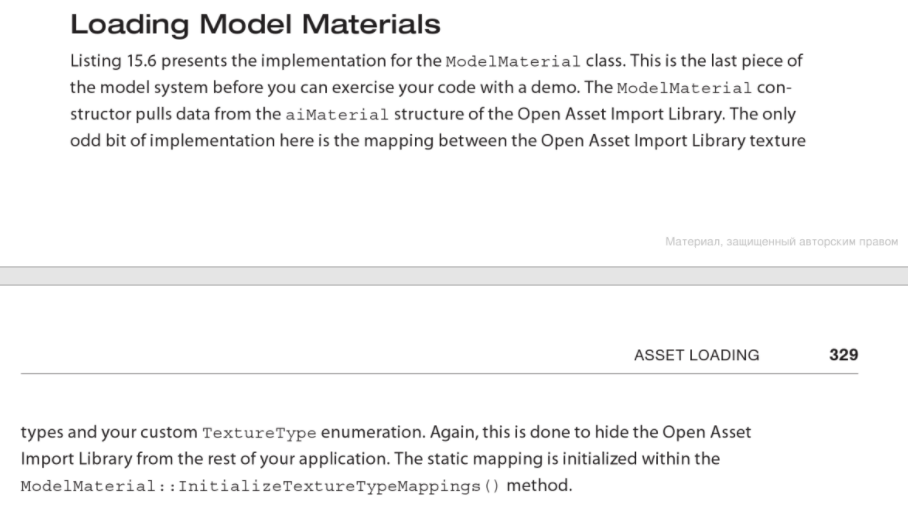
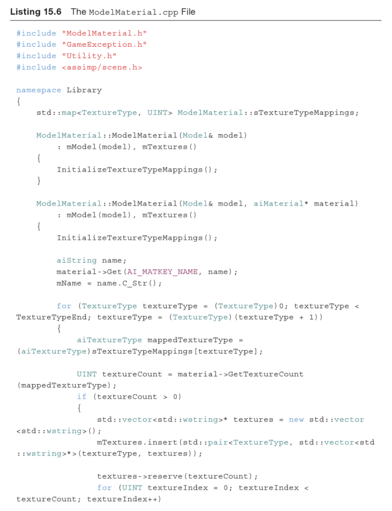
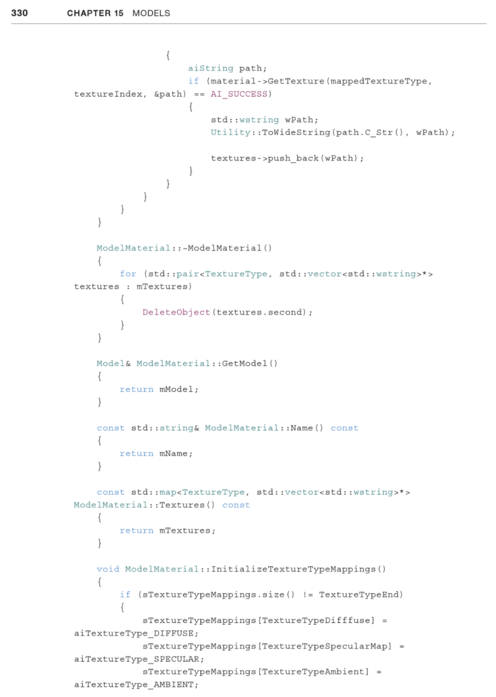
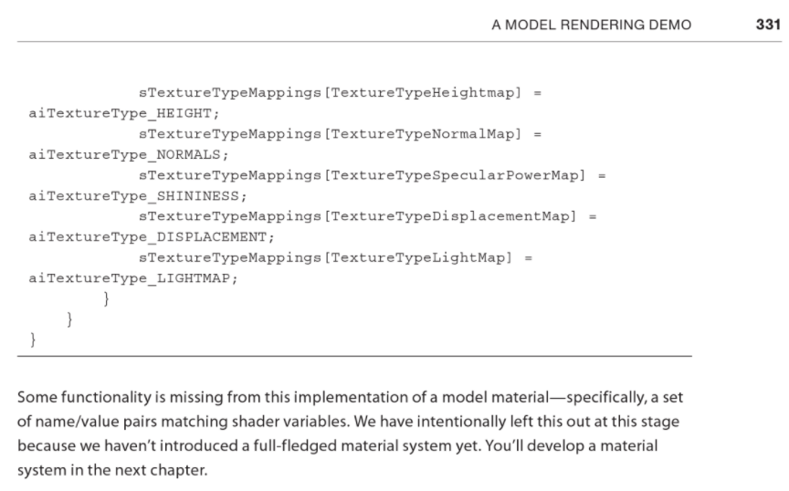

# [Real-Time 3D Rendering with DirectX and HLSL: A Practical Guide to Graphics Programming - Paul Varcholik - Google Книги](https://books.google.kz/books?id=GY-AAwAAQBAJ&printsec=frontcover&hl=ru#v=onepage&q&f=false)

[pvarcholik / real-time-3d-rendering-with-directx-and-hlsl / source / Library.Shared / Utility.cpp — Bitbucket](https://bitbucket.org/pvarcholik/real-time-3d-rendering-with-directx-and-hlsl/src/master/source/Library.Shared/Utility.cpp)
