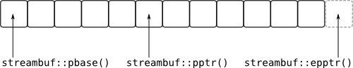
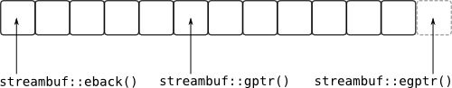

Все стрим-буферы унаследованы от базового класса ```std::streambuf```, в котором
есть виртуальные функции, которые нужно перекрыть, чтобы имплементировать
кастомное поведение. ```std::streambuf``` - это абстракция массива символов
данные которого берутся с устройства с [последовательным доступом](https://ru.wikipedia.org/wiki/%D0%9F%D0%BE%D1%81%D0%BB%D0%B5%D0%B4%D0%BE%D0%B2%D0%B0%D1%82%D0%B5%D0%BB%D1%8C%D0%BD%D1%8B%D0%B9_%D0%B4%D0%BE%D1%81%D1%82%D1%83%D0%BF)
или посылаются на него. В определенных условиях массив может быть перезаполнен
(re-fill для входного буффера) или слит и опустошен (flush для выходного буфера).

При вставке данных в ostream через ```<<```, данные пишутся в массив буфера.
Когда этот массив переполняется (overflow), данные из массива сливаются (sink)
в пункт назначения и состояние ассоциированное с массивом сбрасывается (reset),
становясь готовым принять больше символов.

При извлечении данных из istream через ```>>```, данные считываются из массива
символов. Когда больше нет данных для чтения, то массив становится опустошенным
(underflow), содержимое массива перезаполняется данными из источника и состояние
ассоциированное с массивом сбрасывается.

Для отслеживания различных вещей в массивах стрим-буферов используются 6
указателей, 3 для ввода и 3 для вывода.

Для выходного стрим-буфера:



- ```std::streambuf::pbase()``` возвращает *put base pointer*, который указывает на первый элемент внутреннего массива буфера;
- ```std::streambuf::pptr()``` возвращает *put pointer*, который указывает на следующий символ в буфере, который может быть записан;
- ```std::streambuf::epptr()``` возвращает *end put pointer*, который указывает на one-past-the-last-element внутреннего массива буфера.

Обычно ```pbase()``` и ```epptr()``` не меняются, а меняется только ```pptr()```
в процессе использования буфера.

Для входного стрим-буфера:



- ```std::streambuf::eback()``` возвращает *end back pointer*, который указывает на последний символ (по наименьшему адресу) во внутреннем массиве буфера, в который символ может быть положен обратно (*put back*);
- ```std::streambuf::gptr()``` возвращает *get pointer*, который указывает на символ в буфере, который будет следующим извлечен (extract) через istream;
- ```std::streambuf::egptr()``` возвращает *end get pointer*, который указывает на one-past-the-last-element внутреннего массива буфера.

Обычно ```eback()``` и ```egptr()``` не изменяются в процессе жизненного цикла ```streambuf```.

Входные стрим-буферы для использования с ```istream```-ами сложнее чем выходные
стрим-буферы для работы с ```ostream```-ами потому что мы должны позволить
пользователю класть символы обратно в стрим, что делается с помощью функции ```std::istream's putback()```.
Т.е. мы должны зарезервировать секцию в начале массива как *put-back* пространство.
Обычно ожидается что пространство предоставляется только под один символ.

Для создания входных и выходных буферов нужно унаследоваться от ```std::streambuf```.
Не существует ```std::istreambuf``` или ```std::ostreambuf``` потому что
допустимо существование стрим-буфера, который манипулирует одним и тем же
внутренним массивом, как для чтения из внешних сущностей, так и для записи в них
(dual-purpose streambuf). Так делает, например, ```std::fstream```.

Можно также создать буферы для wide character стримов. ```std::streambuf``` это
фактически typedef для ```std::basic_streambuf<char>```. Также существует
и ```std::wstreambuf```, который typedef для ```std::basic_streambuf<wchar_t>```.
